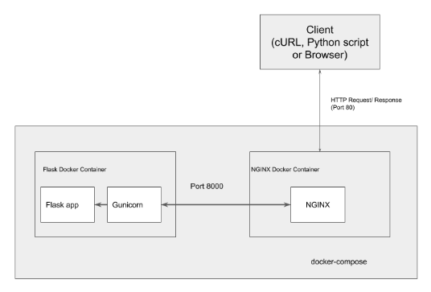

## Objective
Create a scalable REST API database lookup serivce of all the Canadian airports (348), which allows data consumer to inquire by either full or partial city name (case-INsensitive) to receive JSON-formated result.

Each airport carries four (4) element of attributes:
1. City - Name of the city where an airport is located
2. Province - [Two-alphabet postal abbreviation](https://en.wikipedia.org/wiki/Canadian_postal_abbreviations_for_provinces_and_territories)
3. IATA_code - [Three-alphabet geocode](https://en.wikipedia.org/wiki/IATA_airport_code)
4. Rail_service - Flag either 'Y' or 'N'

## Design
Docker containers with the followings in the MVC architecture:

[nginx](https://www.nginx.com/) - Reverse Proxy Web Server  
[gunicorn](https://gunicorn.org/) - WSGI Server  
[Flask](https://palletsprojects.com/p/flask/) - Application Server  
[MongoDB Atlas](https://www.mongodb.com/cloud/atlas) - No SQL database hosted on AWS


(Source [Abhishek Saurabh](https://medium.com/@abhisheksaurabh1985/face-detection-rest-api-in-production-using-docker-nginx-and-flask-1f205633d2d6))

## Use Case
Example 1 (full city name of '**victoria**'):

``` bash
base) to@mx:~/gits/restapi-app$ curl -H "Content-type: application/json" -X GET http://127.0.0.1/city_search -d '{"City":"victoria"}' | python -m json.tool
  % Total    % Received % Xferd  Average Speed   Time    Time     Time  Current
                                 Dload  Upload   Total   Spent    Left  Speed
100   271  100   252  100    19   1184     89 --:--:-- --:--:-- --:--:--  1188
[
    {
        "_id": {
            "$oid": "5dedd3ae8b72b91c057fd562"
        },
        "City": "Victoria",
        "Province": "BC",
        "IATA_code": "YWH",
        "Rail_service": "N"
    },
    {
        "_id": {
            "$oid": "5dedd3ae8b72b91c057fd563"
        },
        "City": "Victoria",
        "Province": "BC",
        "IATA_code": "YYJ",
        "Rail_service": "N"
    }
]
```

Example 2 (partial city name of '**ter**'):
``` bash
(base) to@mx:~/gits/restapi-app$ curl -H "Content-type: application/json" -X GET http://127.0.0.1/city_search -d '{"City":"ter"}' | python -m json.tool
  % Total    % Received % Xferd  Average Speed   Time    Time     Time  Current
                                 Dload  Upload   Total   Spent    Left  Speed
100   534  100   520  100    14   2498     67 --:--:-- --:--:-- --:--:--  2512
[
    {
        "_id": {
            "$oid": "5dedd3ae8b72b91c057fd44e"
        },
        "City": "Chesterfield Inlet",
        "Province": "NU",
        "IATA_code": "YCS",
        "Rail_service": "N"
    },
    {
        "_id": {
            "$oid": "5dedd3ae8b72b91c057fd54c"
        },
        "City": "Terrace",
        "Province": "BC",
        "IATA_code": "YXT",
        "Rail_service": "N"
    },
    {
        "_id": {
            "$oid": "5dedd3ae8b72b91c057fd4c5"
        },
        "City": "Lloydminister",
        "Province": "AB",
        "IATA_code": "YLL",
        "Rail_service": "N"
    },
    {
        "_id": {
            "$oid": "5dedd3ae8b72b91c057fd533"
        },
        "City": "Senneterre",
        "Province": "QC",
        "IATA_code": "XFK",
        "Rail_service": "Y"
    }
]
```

## Reference
[Airport codes - Canada](http://quickaid.com/airport-codes-canada/)


